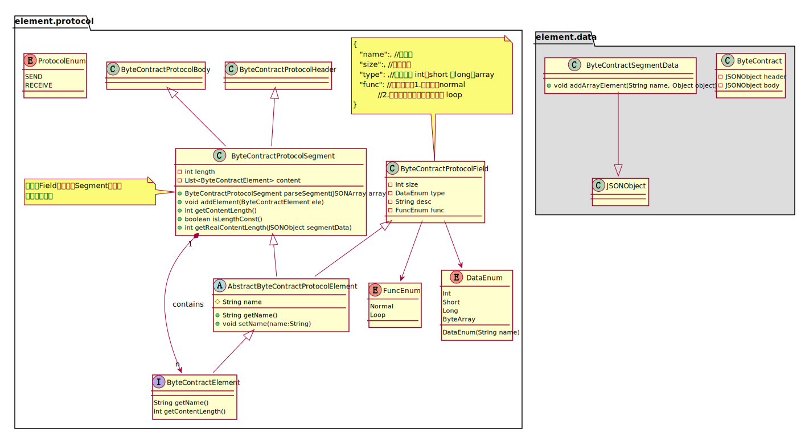
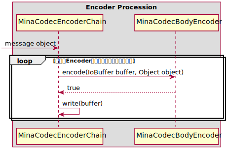
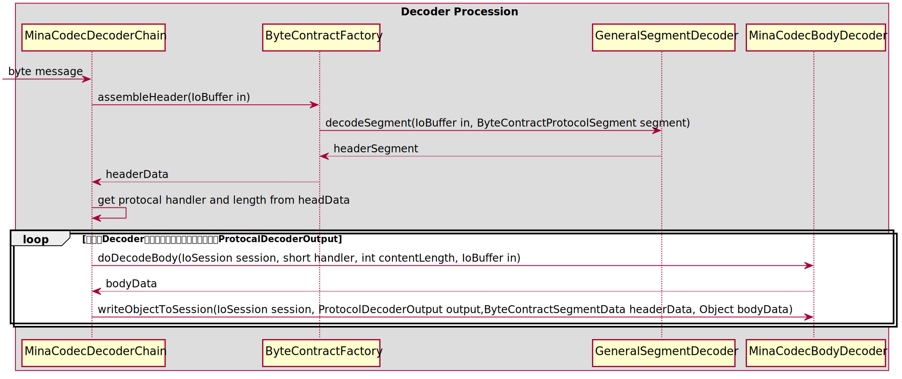

# mina-contract


用于解析mina接口的字节输入输出，使用者只需在协议用json或者yaml定义在resource下即可
* JSON
```json
{
  "0x0101": [
    [
      {
        "name": "stringParam",
        "size": 100,
        "type": "ByteArray",
        "func": "Normal"
      },
      {
        "name": "longParam",
        "size": 8,
        "type": "Long",
        "func": "Normal"
      },
      {
        "name": "tmpId",
        "size": 4,
        "type": "Int",
        "func": "Normal"
      },
      {
        "name": "port",
        "size": 2,
        "type": "Short",
        "func": "Normal"
      }
    ]
  ]
}
```
* yaml
```yaml
#anchor define zone
anchor:
  - bn: &byteNormal {type: ByteArray, func: Normal}
  - ln: &longNormal {size: 8, type: Long, func: Normal}
  - sn: &shortNormal {size: 2, type: Short, func: Normal}
  - in: &intNormal {size: 4, type: Int, func: Normal}

0x0101:
  - - name: stringParam
      size: 100
      <<: *byteNormal
    - name: longParam
      <<: *longNormal
    - name: intParam
      <<: *intNormal
    - name: shortParam
      <<: *shortNormal
```
> 推荐使用**yaml**来进行协议定义

## 特性
* 支持协议头+协议体
* 支持一个协议号，有多种不同长度的协议体，在解析的时候，需要指定消息长度以找到对应的协议体进行解析

## 类图


## 主要逻辑说明
### 挑选匹配的协议规范
在```resource/mina/```文件下，定义了接收和发送的消息协议规范，在编码或者解码前，都需要从协议库中挑选合适的协议规范进行编码或者解码
```java
private ByteContractProtocolBody pickBodySpecification(short handler, int contentLength,
        ProtocolEnum protocolType) {
    logger
        .info("look up for specification: handler<{}>, contentLength<{}>, protocolType<{}>", handler, contentLength,
            protocolType);
    Map<Integer, JSONArray> map = null;
    switch (protocolType) {
        case RECEIVE:
            map = bodyReceiveProtocolMap;
            break;
        case SEND:
            map = bodySendProtocolMap;
            break;
        default:
            logger.error("protocolType<{}> not support!!", protocolType);
    }
    if (map == null) {
        return null;
    }
    Integer handlerKey = Integer.valueOf(handler + "");
    JSONArray array = map.get(handlerKey);
    if (array == null || array.size() == 0) {
        logger.error("handler<{}> has no body protocol set of type<{}>!!!", handler, protocolType);
        return null;
    }
    if (array.size() == 1) {
        JSONArray protocol = array.getJSONArray(0);
        ByteContractProtocolBody bodyProtocol = new ByteContractProtocolBody();
        bodyProtocol.getContentLength();
        bodyProtocol.parseSegment(protocol);
        return bodyProtocol;
    } else {
        ByteContractProtocolBody body = null;
        for (int i = 0; i < array.size(); i++) {
            JSONArray protocol = array.getJSONArray(i);
            ByteContractProtocolBody bodyProtocol = new ByteContractProtocolBody();
            bodyProtocol.parseSegment(protocol);
            int length = bodyProtocol.getContentLength();
            if (length == contentLength) {
                body = bodyProtocol;
                break;
            } else if (length == ContractConst.BODY_CONTENT_LENGTH_VARIABLE) {
                logger.error("can't define more than one VARIABLE_LENGTH body specification.");
                throw new TooMoreSpecificationException();
            }
        }
        if (body == null) {
            logger
                .error("handler<{}> has no body protocol set of type<{}> and length<{}>!!!", handler, protocolType,
                    contentLength);
            return null;
        }
        logger.info("body specification found: {}", body);
        return body;
    }
}
```
### 编码

* 对segment进行编码
```java
public IoBuffer encodeSegment(IoBuffer buffer, JSONObject segmentData,
    ByteContractProtocolSegment protocolSegment) {
    if (CollectionUtils.isEmpty(protocolSegment.getContent())) {
        return buffer;
    }
    int loopCount = 0;
    boolean isLoop = false;
    String loopName = null;
    for (ByteContractElement element : protocolSegment.getContent()) {
        if (isLoop) {
            if (element instanceof ByteContractProtocolField) {
                logger.error("loop segment should be ByteContractProtocolSegment, current<{}>", element);
                throw new LoopSegmentErrorDefineException();
            }
            JSONArray jsonArray = segmentData.getJSONArray(loopName);
            int i = 0;
            while (loopCount > 0) {
                JSONObject itemObj = jsonArray.getJSONObject(i);
                if (element instanceof ByteContractProtocolSegment) {
                    encodeSegment(buffer, itemObj, (ByteContractProtocolSegment) element);
                    i++;
                    loopCount--;
                }
            }
            isLoop = false;
            loopName = null;
        } else {
            if (element instanceof ByteContractProtocolSegment) {
                logger.error("Normal field next should be Field!, current<{}>", element);
                throw new NormalFieldNextErrorDefineException();
            }
            isLoop = ((ByteContractProtocolField) element).isNextLoop();
            if (isLoop) {
                loopName = element.getName();
                JSONArray loopJsonArray = segmentData.getJSONArray(element.getName());
                if (loopJsonArray != null) {
                    loopCount = loopJsonArray.size();
                }
                Object loopCountOfType = makeLoopCountType(loopCount,
                    ((ByteContractProtocolField) element).getType());
                encodeField(buffer, loopCountOfType, (ByteContractProtocolField) element);
            } else {
                encodeField(buffer, segmentData.get(element.getName()), (ByteContractProtocolField) element);
            }
        }
    }
    return buffer;
}
```
* 对Field进行编码
```java
private IoBuffer encodeField(IoBuffer buffer, Object fieldObj, ByteContractProtocolField protocolField) {

    switch (protocolField.getType()) {
        case Short:
            buffer.putShort(Short.parseShort(fieldObj + ""));
            break;
        case Int:
            buffer.putInt(Integer.parseInt(fieldObj + ""));
            break;
        case Long:
            buffer.putLong(Long.parseLong(fieldObj + ""));
            break;
        case ByteArray:
            if (fieldObj != null && !(fieldObj instanceof String)) {
                logger.error("fieldObj<{}> should be String type, current type<{}>", fieldObj,
                    fieldObj.getClass().getName());
                throw new FieldTypeWrongException();
            }
            byte[] byteArrayValue = ByteContractUtil.str2bytes((String) fieldObj, protocolField.getSize());
            buffer.put(byteArrayValue);
            break;
        default:
            logger.error("ByteContractProtocolField type<{}> not supported!", protocolField.getType());
            break;
    }

    return buffer;
}
```


### 解码

* 对segment进行解码
```java
public ByteContractSegmentData decodeSegment(IoBuffer in, ByteContractProtocolSegment segment) {
    ByteContractSegmentData contractData = new ByteContractSegmentData();
    int loopCount = 0;
    boolean isLoop = false;
    String loopName = null;
    for (ByteContractElement ele : segment.getContent()) {
        if (isLoop) {
            if (ele instanceof ByteContractProtocolField) {
                logger.error("loop segment should be ByteContractProtocolSegment, current<{}>", ele);
                throw new LoopSegmentErrorDefineException();
            }
            while (loopCount > 0) {
                Object elementValue = decodeSegment(in, (ByteContractProtocolSegment) ele);
                contractData.addArrayElement(loopName, elementValue);
                loopCount--;
            }
            loopName = null;
            isLoop = false;
        } else {
            if (ele instanceof ByteContractProtocolSegment) {
                logger.error("Normal field next should be Field!, current<{}>", ele);
                throw new NormalFieldNextErrorDefineException();
            }
            Object elementValue = decodeField(in, (ByteContractProtocolField) ele);
            isLoop = ((ByteContractProtocolField) ele).isNextLoop();
            if (isLoop) {
                loopCount = Integer.parseInt(elementValue + "");
                loopName = ele.getName();
            }
            if (!isLoop) {
                contractData.put(ele.getName(), elementValue);
            }
        }
    }
    return contractData;
}
```
* 对Field进行解码
```java
private Object decodeField(IoBuffer in, ByteContractProtocolField field) {
    Object value = null;

    switch (field.getType()) {
        case Short:
            value = in.getShort();
            break;
        case Int:
            value = in.getInt();
            break;
        case Long:
            value = in.getLong();
            break;
        case ByteArray:
            byte[] byteArrayValue = new byte[field.getSize()];
            in.get(byteArrayValue);
            value = new String(byteArrayValue).trim();
            break;
        default:
            logger.error("ByteContractProtocolField type<{}> not supported!", field.getType());
            break;
    }
    return value;
}
```


